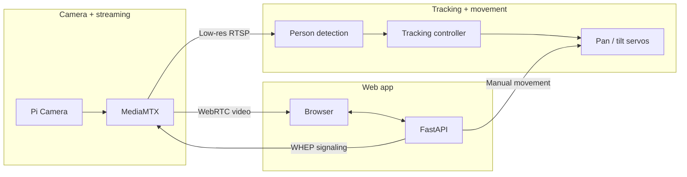

# Raspberry Pi Tracking Camera

A Raspberry Pi camera with live video, browser-based pan/tilt control, person detection, and automatic tracking.

I built it around a Raspberry Pi 4, CSI camera, and two servos. The Pi streams video to a browser over WebRTC and runs person detection locally. When tracking is enabled, the camera moves to keep a detected person near the center of the frame.

## Features

- 720p H.264 video over WebRTC
- pan and tilt control from the browser
- on-device person detection with SSD MobileNet
- automatic person tracking
- sentry behavior when the tracked person leaves the frame
- password-protected UI, API, and stream signaling
- private remote access over Tailscale

## How it works

The system has two paths: one for viewing the camera and one for tracking a person.

The browser receives the 720p stream directly from MediaMTX over WebRTC after the signaling exchange passes through the authenticated FastAPI proxy. Detection uses a separate low-resolution RTSP stream from MediaMTX.

Manual controls and the tracking worker both send movement commands through the backend's servo controller, which talks to the local `pigpio` daemon.

## Stack

- **Backend:** Python, FastAPI
- **Frontend:** React, TypeScript, Vite
- **Vision:** OpenCV, LiteRT, SSD MobileNet
- **Camera control:** pigpio
- **Streaming:** MediaMTX, WebRTC/WHEP, RTSP
- **Networking:** Tailscale
- **Deployment:** Docker Compose, systemd

## Hardware

- Raspberry Pi 4, 64-bit
- Raspberry Pi CSI camera
- two SG90-compatible servos

## Run it

Requires:

- Tailscale
- Docker + Compose
- Python 3
- `pigpiod` at `/usr/local/bin/pigpiod`
- `systemd`, `curl`, `tar`, and `sha256sum`

### 1. Connect the hardware

Connect the CSI camera and servos before powering on the Pi.

| Axis | GPIO | Physical pin |
| --- | ---: | ---: |
| Pan | GPIO18 | 12 |
| Tilt | GPIO13 | 33 |

The servo ground must be shared with the Pi.

Confirm that Raspberry Pi OS detects the camera:

    rpicam-hello --list-cameras

If no camera is listed, check the ribbon connection and the Pi's camera configuration before continuing.

### 2. Configure authentication

    python3 scripts/configure-auth.py .env

Creates the password hash used by the app.

### 3. Configure the Pi

    ./scripts/configure-pi-env.sh

Uses the Pi's Tailscale IPv4 and MagicDNS name to generate `.env` and configure Tailscale Serve on port `8080`.

### 4. Install MediaMTX

On the viewer device, get its Tailscale IPv4:

    tailscale ip -4

Then run this on the Pi:

    sudo ./scripts/install-mediamtx.sh <viewer-tailscale-ip>

This installs the pinned ARM64 MediaMTX build, configures the 720p WebRTC and low-resolution detection streams, and restricts media traffic to that viewer IP.

### 5. Start pigpio

This service expects `pigpiod` at `/usr/local/bin/pigpiod`.

Install the included service:

    sudo install -m 0644 deploy/pigpiod.service /etc/systemd/system/pigpiod.service
    sudo systemctl daemon-reload
    sudo systemctl enable --now pigpiod

### 6. Start the app

    sudo docker compose up -d --build

Open:

    https://<pi-magicdns-name>/

Log in with the password from step 2. Test manual pan/tilt first, then enable **Track person** for automatic tracking.

## Security

The API binds to loopback and is exposed through Tailscale Serve. Authentication protects the controls and stream signaling, while MediaMTX is limited to local/private interfaces.

The deployment also uses:

- scrypt password hashing and login rate limiting
- HTTP-only, SameSite cookies
- a non-root, read-only application container
- dropped Linux capabilities and `no-new-privileges`
- a restricted MediaMTX systemd service

Do not expose the API or MediaMTX ports directly to the public internet without reviewing the deployment first.

## License

MIT. See [LICENSE](LICENSE).
